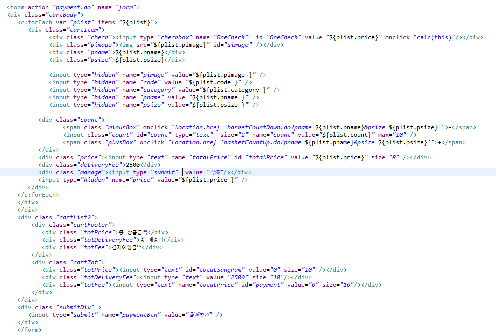
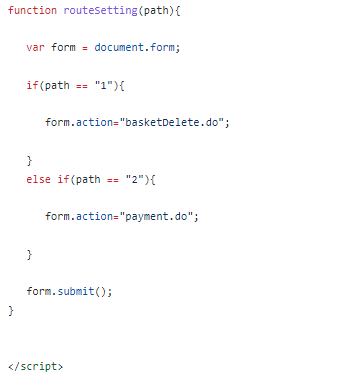
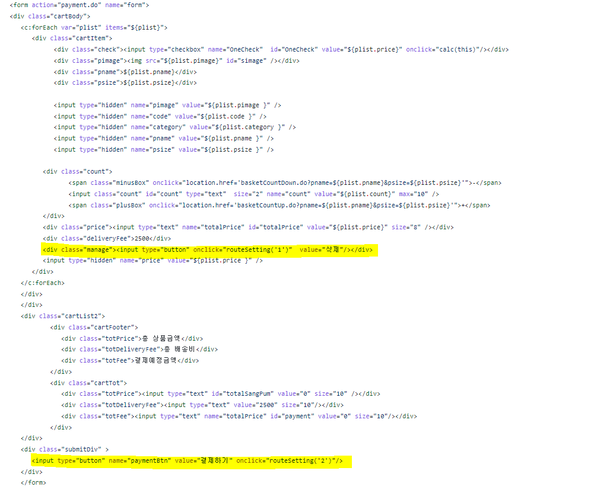

## :pushpin: marguerite
>쇼핑몰 웹 사이트   

 

### 1.제작기간&참여 인원
* 2023.02.13 ~ 2023.03.04   
* 팀프로젝트(3명)

 

### 2.사용기술
* JAVA11   
* ORACLE   
* JAVASCRIPT   
* AJAX   

 

### 3.ERD

 

### 4.핵심기능
이 서비스의 핵심기술은 쇼핑몰에서 원하는 상품을 선택 후 결제할 수 있는 기능입니다.   
사용자가 원하는 상품을 선택 후 바로 결제나 장바구니에 담아서 결제를 할 수 있습니다.   
관리자로 로그인 했을 경우 회원정보나 주문정보를 확인할 수 있습니다.   
   

핵심기능설명펼치기
   
   
#### 4-1. 전체흐름   

   
   
#### 4-2. Controller
 * 요청처리 📍[코드확인](https://github.com/Seoha95/marguerite/blob/8a785e7e7adf4bf9632a3b73bb1d144eee24c273/src/com/shop/controller/frontcontroller.java#L71-L456)  
   * 사용자가 원하는 기능을 처리하기 위한 모든 요청을 컨트롤러에 보냅니다.   
   * 컨트롤러는 모델을 사용해서 알맞은 비즈니스 로직을 수행합니다.   
   * 사용자에게 보여줄 뷰를 선택합니다.   
   * 선택된 뷰는 사용자가 선택한 결과 화면을 보여줍니다.   
   
#### 4-3. 장바구니   
 * 장바구니에 상품 담기 📍[코드확인](https://github.com/Seoha95/marguerite/blob/8a785e7e7adf4bf9632a3b73bb1d144eee24c273/src/dao/DAO.java#L470-L507)   
    * 이미 있는 상품을 장바구니에 담았을 때 수량만 업데이트하고 없는 상품을 담았을 때 insert를 할 수 있습니다.   
   
#### 4-4. 검색기능   
 * 상품 검색 기능 📍[코드확인](https://github.com/Seoha95/marguerite/blob/1fb810d8ee963d0f779f423048e90d01b9295b1b/src/dao/DAO.java#L205-L232)   
    * 상품을 검색하는 기능입니다.      
   
#### 4-4. 베스트 상품보기   
 * 베스트 상품 띄우기 기능 📍[코드확인](https://github.com/Seoha95/marguerite/blob/8a785e7e7adf4bf9632a3b73bb1d144eee24c273/src/dao/DAO.java#L255-L277)    
    * PRODUCT3 테이블을 판매량과 가격을 내림차순으로 정렬해서 10개의 상품만 검색되도록 작성했습니다.    
    * 판매량이 높고 가격이 높은 10개 상품이 베스트 상품으로 뜨게 됩니다.   
 
#### 4-5 회원정보 조회 
 * 관리자모드 회원정보 조회 기능 📍[코드확인](https://github.com/Seoha95/marguerite/blob/8a785e7e7adf4bf9632a3b73bb1d144eee24c273/src/dao/DAO.java#L686-L715)   
   * SIGNUP3, shipping 테이블을 id로 조인하여 회원의 정보를 조회합니다.    
   * 회원의 아이디, 비밀번호, 전화번호, 이름, 주소를 확인할 수 있습니다.      
 
 

   
   
### 5.핵심 트러블 슈팅   
   
#### 5-1 상품을 결제를 할 때와 상품 삭제를 할 때 이동 페이지 다르게 주는 문제   
선택한 상품을 결제할 때는 아임포트 결제 API 페이지가 띄워지고 상품을 삭제를 할 때에도    
아임포트 결제 API 페이지를 들렸다가 삭제가 되는 문제가 있었으나 버튼 클릭시 이동페이지를    
다르게 설정해서 분리 시킬 수 있었습니다.   
   

      

기존코드
      
   
   
     

       
          

      

개선된 코드
      
   
   
   
    

   
   
   
### 6. 느낀점    
   
쇼핑몰 프로젝트를 초반에 만들었을 때는 검색기능을 구현하기 위해서 품목별로 dao코드를 여러개 짠 후에
중복되는 코드가 많다는 것을  어떻게 하면 줄일 수 있을지 고민하고 공부한 결과 1개의 dao로 줄여서 코드 리펙토링을 했습니다.
이러한 경험을 통해 항상 프로젝트를 만든 후에 어떻게 하면 더 클린한 코드를 짤 수 있을지에 대해 더 생각하게 되었습니다. 

