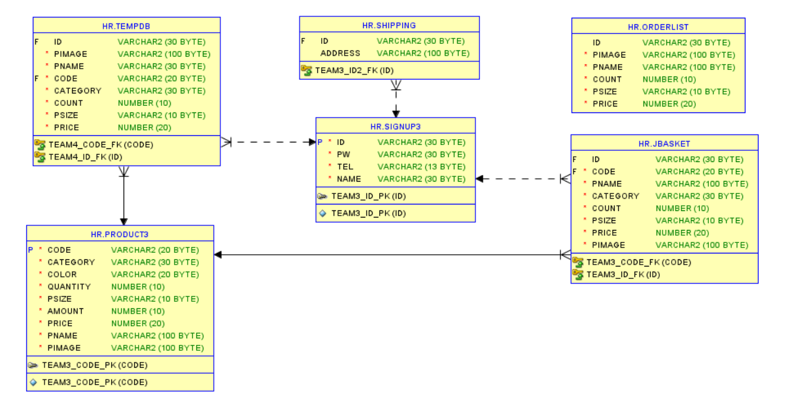
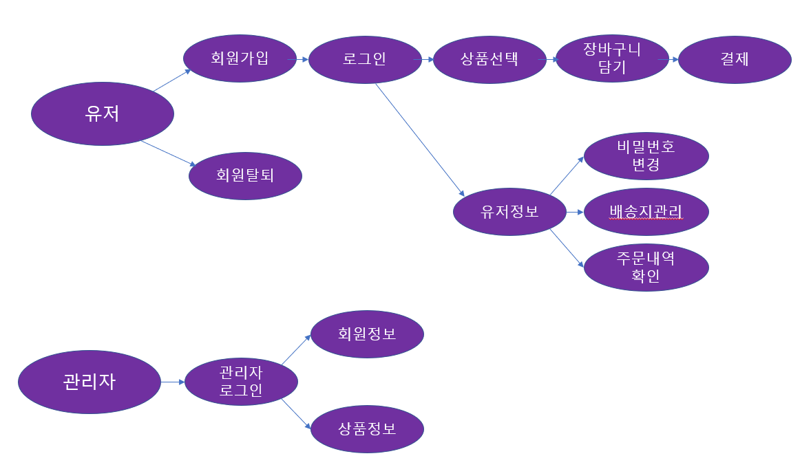

## :pushpin: marguerite
>쇼핑몰 웹 사이트   

 

### 1.제작기간&참여 인원
* 2023.01.02 ~ 2023.01.31
* 팀프로젝트(3명)

 

### 2.사용기술
* JAVA11   
* ORACLE   
* JAVASCRIPT   
* AJAX   

 

### 3.ERD

 

### 4.핵심기능
이 서비스의 핵심기술은 쇼핑몰에서 원하는 상품을 선택 후 결제할 수 있는 기능입니다.   
사용자가 원하는 상품을 선택 후 바로 결제나 장바구니에 담아서 결제를 할 수 있습니다.   
관리자로 로그인 했을 경우 회원정보나 주문정보를 확인할 수 있습니다.   
   

핵심기능설명펼치기
   
   
#### 4-1. 전체흐름   

   
   
#### 4-2. Controller
 * 요청처리 📍[코드확인](https://github.com/Seoha95/marguerite/blob/main/src/com/shop/controller/frontcontroller.java#:~:text=Blame-,package%20com.shop.controller%3B,%7D,-Give%20feedback)  
   * 사용자가 원하는 기능을 처리하기 위한 모든 요청을 컨트롤러에 보냅니다.   
   * 컨트롤러는 모델을 사용해서 알맞은 비즈니스 로직을 수행합니다.   
   * 사용자에게 보여줄 뷰를 선택합니다.   
   * 선택된 뷰는 사용자가 선택한 결과 화면을 보여줍니다.   
   
#### 4-3. 장바구니   
 * 장바구니에 상품 담기 📍[코드확인](https://github.com/Seoha95/marguerite/blob/main/src/dao/DAO.java#:~:text=%EC%97%90%20%EB%8D%B0%EC%9D%B4%ED%84%B0%20%EC%A0%80%EC%9E%A5-,public%20ArrayList%3CBasketVO%3E%20insertBasket(BasketVO%20bvo)%20%7B,%7D,-public%20ArrayList%3C)   
    * 이미 있는 상품을 장바구니에 담았을 때 수량만 업데이트하고 없는 상품을 담았을 때 insert를 할 수 있습니다.   
   
#### 4-4. 검색기능   
 * 상품 검색 기능 📍[코드확인](https://github.com/Seoha95/marguerite/blob/main/src/dao/DAO.java#:~:text=%7D-,public%20ArrayList%3CProductVO%3E%20outerProductInfo()%20throws%20SQLException%20%7B,%7D,-//%20%EC%A3%BC%EB%AC%B8%EB%82%B4%EC%97%ADDB%EC%97%90)   
    * 상품을 검색하는 기능입니다.      
   
#### 4-4. 베스트 상품보기   
 * 베스트 상품 띄우기 기능 📍[코드확인](https://github.com/Seoha95/marguerite/blob/main/src/dao/DAO.java#:~:text=%7D-,public%20ArrayList%3CProductVO%3E%20bestProductInfo()%20throws%20SQLException%7B,%7D,-public%20ArrayList%3C)    
    * PRODUCT3 테이블을 판매량과 가격을 내림차순으로 정렬해서 10개의 상품만 검색되도록 작성했습니다.    
    * 판매량이 높고 가격이 높은 10개 상품이 베스트 상품으로 뜨게 됩니다.   
 
#### 4-5 회원정보 조회 
 * 관리자모드 회원정보 조회 기능 📍[코드확인](https://github.com/Seoha95/marguerite/blob/main/src/dao/DAO.java#:~:text=//%20%EA%B4%80%EB%A6%AC%EC%9E%90%ED%9A%8C%EC%9B%90%EC%A0%95%EB%B3%B4-,public%20ArrayList%3CUserInfoVO%3E%20getMemberInfo()%20throws%20SQLException%7B,%7D,-//%20%EA%B4%80%EB%A6%AC%EC%9E%90%EC%9A%A9%20%EC%A3%BC%EB%AC%B8%EB%82%B4%EC%97%AD%ED%99%95%EC%9D%B8)   
   * SIGNUP3, shipping 테이블을 id로 조인하여 회원의 정보를 조회합니다.    
   * 회원의 아이디, 비밀번호, 전화번호, 이름, 주소를 확인할 수 있습니다.      
 
 

   
   
### 5.핵심 트러블 슈팅   
   
#### 5-1 상품을 결제를 할 때와 상품 삭제를 할 때 이동 페이지 다르게 주는 문제   
선택한 상품을 결제할 때는 아임포트 결제 API 페이지가 띄워지고 상품을 삭제를 할 때에도    
아임포트 결제 API 페이지를 들렸다가 삭제가 되는 문제가 있었으나 버튼 클릭시 이동페이지를    
다르게 설정해서 분리 시킬 수 있었습니다.   
       

      

개선된 코드
           	
'''               
           <input type="hidden" name="pimage" value="${plist.pimage }" />   
           <input type="hidden" name="code" value="${plist.code }" />   
           <input type="hidden" name="category" value="${plist.category }" />   
           <input type="hidden" name="pname" value="${plist.pname }" />   
           <input type="hidden" name="psize" value="${plist.psize }" />   
        
        
   
               -   
               <input class="count" id="count" type="text"  size="2" name="count" value="${plist.count}" max="10" />    
               +   
        
   
        
<input type="text" name="totalPrice" id="totalPrice" value="${plist.price}" size="8" />
   
        
2500
   
        
<input type="button" onclick="routeSetting('1')"  value="삭제"/>
   
        <input type="hidden" name="price" value="${plist.price }" />   
     
   
  </c:forEach>   
  
   	
  
   
  
   
      
    
         
총 상품금액
    
         
총 배송비
     
         
결제예정금액
     
      
     
      
    
         
<input type="text" id="totalSangPum" value="0" size="10" />
   
         
<input type="text" value="2500" size="10"/>
   
         
<input type="text" name="totalPrice" id="payment" value="0" size="10"/>
   
      
   
  
    
  
    
     <input type="button" name="paymentBtn" value="결제하기" onclick="routeSetting('2')"/>    
  
   
  </form>        
'''         

    
   
   
### 6. 느낀점

